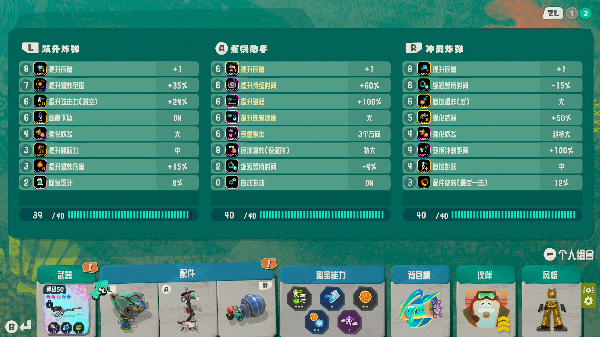

# Splatoon Raiders - Awlmun Den Crates-Only Macro

> 中文说明在下方 / Chinese version below

This repository contains a tested `code.py` for automatically farming **weapon drops from the crates in Awlmun Den (Super Spicy)** using an RP2040 and CircuitPython.

It is based on the RP2040 / Switch HID implementation from the
[original Splatoon Raiders macro project](https://github.com/Deathm0b/splatoon-raiders-macro).

Please refer to the original repository for setup.

This repository only provides the **Awlmun Den farming `code.py`**.

## What it does

The script repeatedly:

1. Enters **Awlmun Den - Super Spicy**
2. Moves to the crate area
3. Breaks the weapon crates
4. Exits the raid
5. Re-enters the stage
6. Repeats

This route is intended specifically for **weapon farming**.

## Tested setup

The script has been successfully tested with:

- Nintendo Switch 2
- RP2040-Zero
- CircuitPython

## Installation

First complete the setup from the
[original project](https://github.com/Deathm0b/splatoon-raiders-macro).

Then replace the existing `code.py` on the `CIRCUITPY` drive with the `code.py` provided here.

## Important

This is a fixed-input macro.

The provided timings are simply the values that work reliably with my setup.

If the route does not line up correctly on your setup, adjust the timing values in `code.py`.

## Build

The following screenshot shows my build to farm.

## Credits

Controller HID implementation and the original RP2040 Splatoon Raiders macro:
[Deathm0b/splatoon-raiders-macro](https://github.com/Deathm0b/splatoon-raiders-macro)

Thanks to Deathm0b for providing the original project and documentation that made this possible.

## 喷射战士 涂击队 - 杏棱巢穴 开箱刷武器宏

本仓库提供一份已经实机跑通的 `code.py`，用于通过 RP2040 + CircuitPython 自动刷**杏棱巢穴的箱子武器掉落**。

本脚本基于[原项目](https://github.com/Deathm0b/splatoon-raiders-macro)的 RP2040 / Switch HID 实现。

关于以下内容，请直接参考原项目：

- RP2040 / CircuitPython 环境配置
- `boot.py`
- Switch 手柄 HID 配置
- 所需文件
- 基础安装流程

本仓库只提供杏棱巢穴刷武器用的 `code.py`。

## 脚本流程

脚本会循环执行：

1. 进入副本
2. 前往箱子区域
3. 打破武器箱
4. 退出副本
5. 重新进入
6. 循环

目标是单纯高速刷武器。

## 已测试环境

目前已经在以下环境实机跑通：

- Nintendo Switch 2
- RP2040-Zero
- CircuitPython

## 使用方法

首先按照[原项目](https://github.com/Deathm0b/splatoon-raiders-macro)完成所有前置配置。

然后将 `CIRCUITPY` 中原有的 `code.py` 替换成本仓库提供的 `code.py`。

## 注意事项

这是一个完全依赖固定输入时序的宏。

仓库中的时序只是在我的配置下已经验证可以稳定运行的一组参数。

如果你的角色无法正确到达箱子位置、瞄准偏移或操作错轴，请自行调整 `code.py` 中对应的时间参数。

## 配件要求

以下是我用来刷武器的配件build：

## 致谢

RP2040 Switch HID 实现以及最初的 Splatoon Raiders 自动挂机项目来自
[Deathm0b/splatoon-raiders-macro](https://github.com/Deathm0b/splatoon-raiders-macro)。

感谢 Deathm0b 分享原始项目与文档，本脚本是在其基础上针对 Awlmun Den 刷武器路线进行的修改与扩展。
